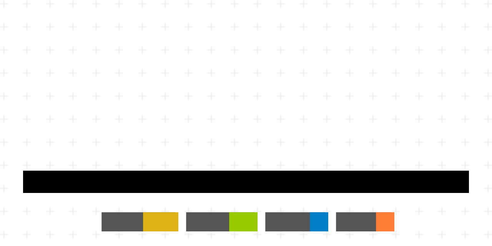

<h1 align="center">Awesome Cloudflare </h1>

本仓库只收录基于Cloudflare的开源工具，为独立开发者早期摸索期提供一个省心省时的工具集，持续整理中……

[中文](./README.md) / [English](./README-EN.md) / [Español](./README-ES.md) / [Deutsch](./README-DE.md)

# 

> 

被称为赛博菩萨的 Cloudflare 提供内容交付网络 （CDN） 服务、DDoS 缓解、互联网安全和分布式域名服务器 （DNS） 服务，位于访问者和 Cloudflare 用户的托管提供商之间，充当网站的反向代理。

**收录标准：**

- 帮助但不限于独立开发者提升开发效率
- 帮助但不限于独立开发者降低成本
- 足够简单便捷

欢迎提 pr 和 issues 更新。 部署或操作过程中有任何问题可以提issue或者私信咨询～

## 在线版本

[Awesome Cloudflare 在线导航](https://cloudflare.chuhai.tools)

## 群组

[一个群](https://t.me/indiehackertools)

## Contents

- 
  - [在线版本](#在线版本)
  - [群组](#群组)
  - [Contents](#contents)
  - [图床](#图床)
  - [邮箱](#邮箱)
  - [博客](#博客)
- [脚手架](#脚手架)
  - [短链](#短链)
  - [网站分析](#网站分析)
  - [隧道](#隧道)
  - [加速](#加速)
  - [文件分享](#文件分享)
  - [测速](#测速)
  - [监控](#监控)
  - [开发者工具](#开发者工具)
- [文章](#文章)
  - [其他](#其他)
  - [教程](#教程)
  - [Contributors](#contributors)
  - [Star History](#star-history)

## 图床

| 名称 | 特性 |在线地址 | 状态|
| --- | --- | --- |---|
| [Telegraph-Image-Hosting](https://github.com/missuo/Telegraph-Image-Hosting) |使用 Telegraph 构建免费图像托管 | | 不再维护|
| [cf-image-hosting](https://github.com/ifyour/cf-image-hosting) |在 Telegraph 上免费无限制地托管图像，部署在 Cloudflare 上。 | <https://images.mingming.dev> |维护中|
| [img-mom](https://github.com/beilunyang/img-mom) |基于 Cloudflare Workers 运行时构建, 轻量使用完全免费，支持多种图床（Telegram/Cloudfalre R2/Backblaze B2, 更多图床正在支持中），快速部署。使用 Wrangler 可快速实现自部署 | |维护中|
| [workers-image-hosting](https://github.com/iiop123/workers-image-hosting) |基于cloudflare workers数据存储于KV的图床 | |维护中|
| [Telegraph-Image](https://github.com/cf-pages/Telegraph-Image) |免费图片托管解决方案，Flickr/imgur 替代品。使用 Cloudflare Pages 和 Telegraph。 | <https://im.gurl.eu.org/> |维护中|
| [cloudflare-worker-image](https://github.com/ccbikai/cloudflare-worker-image) |使用 Cloudflare Worker 处理图片, 依赖 Photon，支持缩放、剪裁、水印、滤镜等功能。 |  |维护中|
| [tgState](https://github.com/csznet/tgState) |使用Telegram作为存储的外链系统，不限制大小和格式。 | <https://tgstate.vercel.app>  |维护中|
| [telegraph-Image](https://github.com/x-dr/telegraph-Image) |一个图床。 | <https://img.131213.xyz/> |维护中|
| [roim-picx](https://github.com/roimdev/roim-picx) |基于CloudFlare Pages和R2实现的免费图床。 |  |维护中|
| [CloudFlare-ImgBed](https://github.com/MarSeventh/CloudFlare-ImgBed) |基于CloudFlare和Telegraph的免费图床，本仓库基于<https://github.com/cf-pages/Telegraph-Image> ，是原项目前端页面的重制版。开源、清晰、美观、动画丝滑、玩法多样！ |  <https://demo-cloudflare-imgbed.pages.dev/> |维护中|
| [imgUU](https://github.com/yestool/imgUU) |一个基于Cloudflare D1和R2构建的免费图片上传应用Github登陆管理。 |  <https://imguu.net/> |维护中|
| [cloudflare-r2-telegram-bot](https://github.com/xinycai/cloudflare-r2-telegram-bot) |基于cloudflare worker与R2存储桶的图床机器人。 |   |维护中|
| [PixR2](https://github.com/WangQueXL/PixR2) |基于 Cloudflare Workers + R2 的多入口图床与图片管理平台 |   |维护中|

## 邮箱

| 名称 | 特性 |在线地址 | 状态|
| --- | --- | --- |---|
| [vmail](https://github.com/oiov/vmail) |📫 Open source temporary email tool. 开源临时邮箱工具，支持收发邮件。 | <https://vmail.dev/> | 维护中|
| [smail](https://github.com/akazwz/smail) |临时邮箱服务| <https://smail.pw/> | 维护中 |
| [Email.ML](https://email.ml/) | 一个运行在 Cloudflare 网络中的临时邮箱|  | 未开源 |
| [cloudflare_temp_email](https://github.com/dreamhunter2333/cloudflare_temp_email) | 使用 cloudflare 免费服务，搭建临时邮箱，D1 作为数据库，带有前端及后端，支持多国语言及自动回复功能，支持附件 IMAP SMTP|  <https://mail.awsl.uk/> | 维护中 |
| [mail2telegram](https://github.com/TBXark/mail2telegram) | 这是一个基于 Cloudflare Email Routing Worker 的 Telegram Bot，可以将电子邮件转换为 Telegram 消息。您可以将任何前缀的收件人的电子邮件转发到 Bot，然后将创建一个具有无限地址的临时邮箱 Bot。|  | 维护中 |
| [AuthInbox](https://github.com/TooonyChen/AuthInbox) | 一个自建的开源多邮箱验证码的接码平台，基于 Cloudflare 的免费服务。它可以自动处理收到的邮件，提取验证码或链接，并将其存储在数据库中。管理员可以通过一个用户友好的网页界面轻松查看提取的信息。AuthInbox 还支持通过 Bark 进行实时通知，使其成为一个全面且省心的邮件认证管理解决方案。|  | 维护中 |
| [moemail](https://github.com/beilunyang/moemail) | MoeMail - 基于 NextJS + Cloudflare 技术栈构建的可爱临时邮箱服务 。| <https://moemail.app> | 维护中 |
| [zmail](https://github.com/zaunist/zmail) | Z-Mail - 基于 CloudFlare 的 pages、worker 以及 D1 SQL 搭建的极简临时邮箱服务，支持接收附件。| <https://mail.mdzz.uk/> | 维护中 |
| [cloud-mail](https://github.com/LaziestRen/cloud-mail) | 用Vue3开发的响应式简约邮箱服务，支持邮件发送附件收发，可以部署到Cloudflare云平台。| <https://skymail.ink> | 维护中 |
| [Alle](https://github.com/bestruirui/Alle) | AI识别的邮件聚合客户端，支持验证码提取、链接分类、临时邮箱服务。基于Cloudflare Workers + Next.js构建，无需服务器，仅需一个域名即可部署。| | 维护中 |
| [FreeTempMail](https://github.com/PennyJoly/FreeTempMail) | 清爽简约风的永久免费临时邮件服务。保护用户隐私数据，支持i18n国际化，即用即走。基于NuxtPro模板和CF开发。| <https://mail.aitre.cc> | 维护中 |

## 博客

| 名称 | 特性 |在线地址 | 状态|
| --- | --- | --- |---|
| [cloudflare-workers-blog](https://github.com/gdtool/cloudflare-workers-blog) |这是一个运行在cloudflare workers 上的博客程序,使用 cloudflare KV作为数据库,无其他依赖. 兼容静态博客的速度,以及动态博客的灵活性,方便搭建不折腾. |   <https://blog.gezhong.vip/> | 维护中|
| [cloudflare-workers-blog](https://github.com/kasuganosoras/cloudflare-worker-blog) |Cloudflare workers + Github 实现的动态博客系统，使用边缘计算，无需服务器| | 好像是不维护了|
| [microfeed](https://github.com/microfeed/microfeed) |一个在 Cloudflare 上自托管的轻量级内容管理系统 (CMS)。通过 microfeed，您可以轻松地将各种内容（例如音频、视频、照片、文档、博客文章和外部 URL）以 Web、RSS 和 JSON 的形式发布到 feed。对于想要自行托管自己的 CMS 而无需运行自己的服务器的精通技术的个人来说，这是完美的解决方案。| <https://www.microfeed.org/> | 维护中|
| [emaction.frontend](https://github.com/emaction/emaction.frontend) |基于Cloudflare D1实现的 GitHub 风格的 Reactions 点赞功能， 本项目是前端。| <https://emaction.cool/>| 维护中|
| [emaction.backend](https://github.com/emaction/emaction.backend) |基于Cloudflare D1实现的 GitHub 风格的 Reactions 点赞功能， 本项目是后端。| <https://emaction.cool/> | 维护中|
| [serverless-cloud-notepad](https://github.com/s0urcelab/serverless-cloud-notepad) |基于 Cloudflare Worker 实现的Serverless Cloud Notepad 云笔记。| <https://note.src.moe/y6y> | 维护中|
| [Rin](https://github.com/openRin/Rin/) |Rin 是一个基于 Cloudflare Pages + Workers + D1 + R2 全家桶的博客，无需服务器无需备案，只需要一个解析到 Cloudflare 的域名即可部署。| <https://docs.openrin.org/> | 维护中|
| [cf-comment](https://github.com/joyance-professional/cf-comment) |一个基于 Cloudflare Workers 运行的简单评论系统，支持回复、点赞、举报以及管理员后台管理功能；同时提供中英双语切换，方便更广泛地使用。| <https://comment.joyance.page/area/test-4> | 维护中|
| [Gins-Blog](https://github.com/IchimaruGin728/Gins-Blog) |一个高性能、Agentic-First 的博客平台。完全基于 Cloudflare 生态 (Workers, Pages, D1, KV, R2, Vectorize)。内置 MCP 协议，支持通过 OpenClaw 零人工自动部署。| <https://blog.ichimarugin728.com> | 维护中|

# 脚手架

| 名称 | 特性 |在线地址 | 状态|
| --- | --- | --- |---|
| [nextflare](https://github.com/ccbikai/nextflare) |Next.js App running with Lemon Squeezy on Cloudflare. |   <https://nextflare-template.pages.dev/> | 维护中|

## 短链

| 名称 | 特性 |在线地址 | 状态|
| --- | --- | --- |---|
| [short](https://github.com/igengdu/short/) |一个使用 Cloudflare Pages 创建的 URL 缩短器。| <https://d.igdu.xyz/> | 维护中|
| [short](https://github.com/x-dr/short) |一个使用 Cloudflare Pages 创建的 URL 缩短器。| <https://d.131213.xyz/> | 维护中|
| [linklet](https://github.com/harrisonwang/linklet) |一个使用 Cloudflare Pages 创建的 URL 缩短器。这个是基于API模式实现，使用场景更多一些 | <https://wss.so/> | 维护中|
| [Url-Shorten-Worker](https://github.com/crazypeace/Url-Shorten-Worker) |使用秘密路径访问操作页面。支持自定义短链。API 不公开服务。页面缓存设置过的短链。长链接文本框预搜索localStorage。增加删除某条短链的按钮。增加读取KV的按钮。变身网络记事本 Pastebin。变身图床 Image Hosting。A URL Shortener created using Cloudflare worker and KV| <https://urlsrv.crazypeace.workers.dev/bodongshouqulveweifengci> | 维护中 |
| [duanwangzhi](https://github.com/Closty/duanwangzhi) |无需服务即可缩短您的链接，因为它基于 Cloudflare 工作人员功能，具有极简风格。|  | 好像是不维护了 |
| [Url-Shorten-Worker](https://github.com/horsemail/Url-Shorten-Worker) |这个是fork的crazypeace的Url-Shorten-Worker， 使用秘密路径访问操作页面。支持自定义短链。API 不公开服务。页面缓存设置过的短链。长链接文本框预搜索localStorage。增加删除某条短链的按钮。增加读取KV的按钮。变身网络记事本 Pastebin。变身图床 Image Hosting。A URL Shortener created using Cloudflare worker and KV。| <https://1way.eu.org/bodongshouqulveweifengci> | 维护中  |
| [CloudFlare-Pages-UrlShorten](https://github.com/Jiaocz/CloudFlare-Pages-UrlShorten) |一个多功能的URL短链工具。|  | 维护中 |
| [Url-Shorten-Worker](https://github.com/Monopink/Url-Shorten-Worker/) |在原分支和 crazypeace 分支部分功能基础上优化了页面，增加了管理员用户、访客身份，增加正则表达式匹配功能，支持了环境变量配置，以及其他细节性改进。| <https://url-shortener-demo.jhw.li/> | 维护中  |
| [CloudflareWorker-KV-UrlShort](https://github.com/Ai-Yolo/CloudflareWorker-KV-UrlShort) |使用Cloudflare Worker创建的URL缩短器, 支持自定义首页, 支持Menu Short, 支持短网址、文本、网页分享 URL。|  | 维护中|
| [Sink](https://github.com/ccbikai/Sink) |ccbikai/Sink 是一个在 Cloudflare 上完全运行的简单、快速、安全的链接缩短器，具备分析功能和控制台面板.| <https://sink.cool/> | 维护中|
| [short](https://github.com/molikai-work/short) | 基于 x-dr/short 的项目修改，新增了可以设置短链密码和管理短链、使用 Turnstile 人机验证、黑名单域名管理、跳转页面配置、多域名配置使用。 | [Demo 地址](https://c1n.top/) | 维护中 |
| [CFWorkerUrls](https://github.com/PIKACHUIM/CFWorkerUrls) | 一个基于CF Worker的短链接跳转服务，支持Lucky STUN自动化 。 | <https://1web.us.kg/> | 维护中 |

## 网站分析

| 名称 | 特性 |在线地址 | 状态|
| --- | --- | --- |--- |
| [analytics_with_cloudflare](https://github.com/yestool/analytics_with_cloudflare) |免费开源网页访客计数器, Webviso 是一个基于Cloudflare worker服务+Cloudflare D1数据库实现的完全免费的在线web访客统计服务。 功能与目前常用的 不蒜子 - 极简网页计数器 相同。Webviso完全开源，你可以实现自定义需求。 基于Cloudflare的微服务架构可快速自行部署上线。 | <https://webviso.yestool.org/> |维护中|
| [counterscale](https://github.com/benvinegar/counterscale) |Counterscale 是一个简单的 Web 分析跟踪器和仪表板，效果和 umami 类似，您可以在 Cloudflare 上自行托管。它的设计易于部署和维护，即使在高流量的情况下，您的操作成本也应该接近于零（Cloudflare 的免费套餐假设可以支持每天高达 10 万次点击）。 | <https://counterscale.dev/> |维护中|
| [HanAnalytics](https://github.com/uxiaohan/HanAnalytics) |一个部署在Cloudflare Pages上的简单的网络分析跟踪器和仪表板，是umami的精简版，它支持设备查看、来源查看、国家地区及设备OS等数据查看分析，支持密码访问，域名白名单等功能。 |  |维护中|
| [PageGuard](https://github.com/sleepyxpad-jpg/pageguard) |免费网站健康扫描器，基于 Cloudflare Workers + D1 + Workers AI（Llama 3.1）。检查 SEO、性能（Core Web Vitals）、无障碍（WCAG 2.1）、最佳实践，30 秒出 AI 诊断报告，无需注册登录。 | <https://pageguard.org> |维护中|

## 隧道

| 名称 | 特性 |在线地址 | 状态|
| --- | --- | --- |--- |
| [Cloudflared-web](https://github.com/WisdomSky/Cloudflared-web) |Cloudflared-web 是一个 docker 镜像，它打包了 cloudflared cli 和简单的 Web UI，以便轻松启动/停止 cloudflare 隧道。 |  |维护中|

## 加速

| 名称 | 特性 |在线地址 | 状态|
| --- | --- | --- |--- |
| [gh-proxy](https://github.com/hunshcn/gh-proxy) |github release、archive以及项目的加速项目，支持clone，有Cloudflare Workers无服务器版本以及Python版本。 | <https://gh.api.99988866.xyz/> |维护中|
| [githubbox](https://github.com/dferber90/githubbox) |在 CodeSandbox 中快速打开任何 GitHub 存储库。 |  |好像不维护了|
| [gh-proxy](https://github.com/crazypeace/gh-proxy) |github release、archive以及项目文件的加速项目. 支持 api.github.com, git.io. | <https://ghproxy.lvedong.eu.org/> |维护中|
| [cf-proxy-ex](https://github.com/1234567Yang/cf-proxy-ex) |Cloudflare超级代理，Duckduckgo代理（可用AI聊天），OpenAI/ChatGPT代理，Github加速，在线代理。Cloudflare super proxy, setting up a free proxy by using Cloudflare worker. | <https://y.demo.wvusd.homes/> |维护中|
| [cloudflare-docker-proxy](https://github.com/ciiiii/cloudflare-docker-proxy) |一个名为 cloudflare-docker-proxy 的项目，这是一个在 Cloudflare Worker 上运行的 Docker Hub 注册代理. |  |维护中|
| [CF-Workers-docker.io](https://github.com/cmliu/CF-Workers-docker.io) |这个项目是一个基于 Cloudflare Workers 的 Docker 镜像代理工具。它能够中转对 Docker 官方镜像仓库的请求，解决一些访问限制和加速访问的问题. | <https://docker.fxxk.dedyn.io/> |维护中|
| [Page-api-forwarder](https://github.com/xinjianzhanghao/page-api-forwarder) | 它可以帮助您绕过某些API上的IP限制，并且由于它通过Cloudflare，因此速度很快。 |  |维护中|
| [AI-worker](https://github.com/qyjoy/AI-worker) | 通过Cloudflare免费、私有化访问和管理Gemini~摆脱地域限制无烦恼，完全由自己掌控。 |  |维护中|
| [gemini-balance-do](https://github.com/zaunist/gemini-balance-do) | 基于 Cloudflare Worker 和 Durable Objects 实现的 Gemini API 中转（多key负载均衡），稳定美国 IP 访问 Gemini | https://github.com/zaunist/gemini-balance-do | 维护中 |
| [LLMKit](https://github.com/smigolsmigol/llmkit) | Open-source AI API gateway built on CF Workers + Durable Objects. Cost tracking, budget enforcement, rate limiting for 11 LLM providers (OpenAI, Anthropic, Gemini, etc). TypeScript SDK, CLI, MCP server. MIT license. | <https://github.com/smigolsmigol/llmkit> | 维护中 |

## 文件分享

| 名称 | 特性 |在线地址 | 状态|
| --- | --- | --- |--- |
| [pastebin-worker](https://github.com/SharzyL/pastebin-worker) |介绍一个部署在 Cloudflare Workers 上的开源 Pastebin，通过URL分享"文本"或"文件"。如CF免费套餐：每天允许 10W 次读取、1000 次写入和 删除操作，大小限制在 25 MB 以下，轻量用足够了。自己部署或直接用。它还有“删除时间设置”和“密码”功能，可以设置一段时间后删除您的paste。用于twitter分享文件和文本，极好 | <https://shz.al/> |维护中|
| [FileWorker](https://github.com/yllhwa/FileWorker) |运行在Cloudflare Worker上的在线剪贴板/文件共享 |  |维护中|
| [dingding](https://github.com/iiop123/dingding) |一款基于cloudflare workers的文件传输工具，文件存储在cloudflare KV中 |  |好像不维护了|
| [cf-files-sharing](https://github.com/joyance-professional/cf-files-sharing) |在该项目中，利用 Cloudflare Workers 的全球加速优势，实现了一个支持密码保护的文件分享工具，并集成了 Cloudflare 的 D1 数据库和 R2 存储，以满足不同大小文件的存储需求 |  |维护中|
| [CloudPaste](https://github.com/ling-drag0n/CloudPaste) |基于Cloudflare的在线文本/大文件分享平台，支持多种语法 Markdown 渲染、阅后即焚、S3/WebDav/TG/OneDrive等多存储聚合、密码保护等功能，可作为WebDav挂载，支持Docker部署。| <https://doc.cloudpaste.qzz.io/>  |维护中|
| [cf-drop](https://github.com/lyonbot/cf-drop) |一个「文件传输助手」，运行在 Cloudflare Worker + R2 + D1。具备PWA移动端优化、支持多线程文件下载、访问密码、打包下载tarball 等功能。界面简单易用，可放到浏览器侧栏，或者添加到手机桌面上快速使用。|   |维护中|
| [serverless-webdav](https://github.com/jiacai2050/my-works/blob/main/serverless-webdav/README.zh-CN.md) | 基于 Cloudflare Workers 和 Cloudflare D1 数据库 构建的轻量级、可扩展的 WebDAV 服务器实现。 |   |维护中|

## 测速

| 名称 | 特性 |在线地址 | 状态|
| --- | --- | --- |--- |
| [CloudflareSpeedTest](https://github.com/XIU2/CloudflareSpeedTest) |国外很多网站都在使用 Cloudflare CDN，但分配给中国内地访客的 IP 并不友好（延迟高、丢包多、速度慢）。虽然 Cloudflare 公开了所有 IP 段 ，但想要在这么多 IP 中找到适合自己的，怕是要累死，于是就有了这个软件。 | |维护中|
| [SpeedTest](https://speed.cloudflare.com/) |官方的SpeedTest工具。 | |运行中|
| [ip-check](https://github.com/lovegitgit/ip-check) |Python 实现的Cloudflare CDN 测速工具，支持多种方式传入ip（文本、ipv4/ipv6、端口、优选域名等）、自定义端口、ip 归属地筛选、ip 组织名筛选等。 | |维护中|

## 监控

| 名称 | 特性 |在线地址 | 状态|
| --- | --- | --- |--- |
| [UptimeFlare](https://github.com/lyc8503/UptimeFlare) |基于 Cloudflare Worker 的无服务器站点监控工具， 支持 HTTP/HTTPS/TCP 多种协议的端口监控， 可以从全球数百个城市发起地理位置特定的检查， 自定义的请求参数和响应校验规则,灵活适配各类监控场景。 | <https://uptimeflare.pages.dev/> |维护中|
| [cf-workers-status-page](https://github.com/eidam/cf-workers-status-page) |监控您的网站，展示状态（包括每日历史记录），并在网站状态发生变化时收到 Slack 通知。使用 Cloudflare Workers、CRON 触发器和 KV 存储。 | <https://status-page.eidam.dev/> |维护中|
| [xugou](https://github.com/zaunist/xugou)| 基于 CloudFlare 的站点监控以及服务器监控工具。 | https://xugou.mdzz.uk/ |  维护中
| [cf-vps-monitor](https://github.com/kadidalax/cf-vps-monitor)| 一个部署在 Cloudflare Workers 上的简单 VPS 监控 + 网站监测 面板，使用 Cloudflare D1 数据库存储数据。 | <https://vps-monitor.abo-vendor289.workers.dev/> |  维护中
| [SSL Certificate Monitor](https://github.com/brancogao/ssl-certificate-monitor) | SSL 证书到期监控工具，检查 SSL 证书有效期并通过 RESTful API 提供服务。 | <https://ssl-certificate-monitor.autocompany.workers.dev/> |维护中|
| [deploy-mcp](https://github.com/alexpota/deploy-mcp) | 为AI助手提供的通用部署跟踪器，支持实时状态徽章和部署监控，包括对 Cloudflare Pages 的支持。 | https://deploy-mcp.io | 有效中 |
| [What Broke Today](https://whatbroke.today/) | AI 驱动的宕机聚合器，追踪 100+ 云服务（包括 Cloudflare）的状态，提供实时 Telegram 警报、RSS 订阅和 JSON API。 | <https://whatbroke.today/> | 维护中 |

## 开发者工具

| 名称 | 特性 |在线地址 | 状态|
| --- | --- | --- |--- |
| [Webhook Debugger](https://github.com/brancogao/webhook-debugger) | 自托管 Webhook 调试工具，支持签名验证（Stripe/GitHub/Slack/Shopify）、90天历史、全文搜索、一键重放。基于 Cloudflare Workers + D1 构建。 | <https://webhook-debugger.autocompany.workers.dev> | 维护中 |

# 文章

| 名称 | 特性 |在线地址 | 状态|
| --- | --- | --- |--- |
| [workers](https://igdux.com/workers) |Cloudflare Workers优秀项目收集。| |有效中|
| [accelerate-and-secure-with-cloudflared](https://nova.moe/accelerate-and-secure-with-cloudflared/) |这是一篇博客，主要是教你使用 Cloudflare Argo Tunnel(cloudflared) 来加速和保护你的网站。 |  |有效中|
| [jsonbin](https://www.owenyoung.com/blog/jsonbin/) |在 Cloudflare Workers 部署一个 JSON as a Storage 服务。| |有效中|
| [cronbin](https://www.owenyoung.com/blog/cronbin/) |在 Cloudflare Workers 部署一个带有 Dashboard 的 Cron 服务。| |有效中|
| [using-cloudflare-worker-proxy-google](https://xiaowangye.org/posts/using-cloudflare-worker-proxy-google/) |使用 Cloudflare Worker 代理 Google 站点。| |有效中|
| [Use-Cloudflare-Zero-Trust-protect-your-web-applications](https://jiapan.me/2023/Use-Cloudflare-Zero-Trust-protect-your-web-applications/) |使用 Cloudflare Zero Trust 保护你的 Web 应用。| |有效中|
| [Nextjs-app-router-with-cloudflare-r2](https://juejin.cn/post/7306723921717166131) |如何在 Next.js 13的 app/ 目录中使用 Cloudflare R2 存储。| |有效中|
| [cloudflare-webssh-zerotrust](https://josephcz.xyz/technology/network/cloudflare-webssh-zerotrust/) |使用 Cloudflare ZeroTrust 搭建 WebSSH。| |有效中|
| [免费的 CAPTCHA 替代品](https://www.cloudflare.com/zh-cn/products/turnstile/) |官方出品，免费的 CAPTCHA 替代品。| |有效中|
| [通过 Cloudflare 页面函数向 Telegram 发消息](https://liujiacai.net/blog/2024/05/07/telegram-bot-functions/) | 介绍如何利用页面函数作为 GitHub 的 Webhook 地址，将指定事件转发到 Telegram 频道中。| |有效中|
| [使用Cloudflare Workers制作博客AI摘要](https://mabbs.github.io/2024/07/03/ai-summary.html) | 介绍使用Cloudflare Workers + Workers AI + D1数据库实现博客AI摘要。| |有效中|
| [使用CF Workers Cron触发器进行签到](https://mabbs.github.io/2023/02/22/cron.html) | 这篇文章讲述了作者在云原神签到脚本被Github Actions禁用后，选择使用Cloudflare Workers Cron触发器的原因。| |有效中|
| [用Workers免服务器部署挪车二维码，可微信通知、拨打电话](https://www.dujin.org/23105.html) | 基于微信推送实现消息通知。| |有效中|
| [使用 Cloudflare Worker、Hono 和 Telegram Bot API 构建 RSS 订阅推送系统](https://calpa.me/blog/build-rss-subscription-push-system-with-cloudflare-worker-hono-telegram-bot-api/) | 本文详细介绍如何利用 Cloudflare Worker、Hono 框架和 Telegram Bot API 构建一个自动监控 RSS 订阅源并推送更新到 Telegram 频道的系统。该方案完全 Serverless，无需服务器，适合个人开发者和小型团队，支持定时任务和消息去重。| |有效中|

## 其他

| 名称 | 特性 |在线地址 | 状态|
| --- | --- | --- |--- |
| [silk-privacy-pass-client](https://chromewebstore.google.com/detail/silk-privacy-pass-client/ajhmfdgkijocedmfjonnpjfojldioehi) |频繁出现Cloudflare人机验证，可以用这个Cloudflare官方插件解决，装了之后，再也不会动不动跳出人机验证了。 | | 维护中|
| [WARP-Clash-API](https://github.com/vvbbnn00/WARP-Clash-API) |该项目可以让你通过订阅的方式使用WARP+，支持Clash、Shadowrocket等客户端。项目内置了 刷取WARP+流量的功能，可以让你的WARP+流量不再受限制（每18秒可获得1GB流量），同时， 配备了IP选优功能。支持Docker compose 一键部署，无需额外操作，即可享受你自己的WARP+私 有高速节点！ | |维护中|
| [ip-api](https://github.com/ccbikai/ip-api) |利用 Cloudflare Workers / Vercel Edge / Netlify Edge 快速搭一个获取 IP 地址和地理位置信息的接口。|<https://html.zone/ip> |维护中|
| [ChatGPT-Telegram-Workers](https://github.com/TBXark/ChatGPT-Telegram-Workers) |轻松在 Cloudflare Workers 上部署您自己的 Telegram ChatGPT 机器人，有详细的视频和图文教程，搭建过程也不复杂，小白也能上手。| |维护中|
| [RSSWorker](https://github.com/yllhwa/RSSWorker) |RSSWorker 是一个轻量级的 RSS 订阅工具，可以部署在 Cloudflare Worker 上。| |维护中|
| [deeplx-for-cloudflare](https://github.com/ifyour/deeplx-for-cloudflare) |Deploy DeepLX on Cloudflare。|<https://deeplx.mingming.dev/> |维护中|
| [sub_converter_convert](https://github.com/zzNeutrino/sub_converter_convert) |转换ssr/v2ray订阅链接转换的工具。| |好像不维护了|
| [telegram-counter](https://github.com/iamshaynez/telegram-counter) |用纯粹的 Cloudflare Worker 和 D1 数据库写了个 Telegram 的后端，方便可以随时随地的做一些打卡的记录……。| |好像不维护了|
| [Cloudflare-No-Tracked](https://github.com/fwqaaq/Cloudflare-No-Tracked) | 用于去除 b 站以及小红书的跟踪链接，同时也有 tg 的 bot 版本 | <https://notracked.fwqaq.us/> | 维护中 |
| [dnschecker](https://dnschecker.org/) | Cloudflare官方推荐的，检测域名解析 |  | 有效中 |
| [blockedinchina](https://www.comparitech.com/privacy-security-tools/blockedinchina/) |  Cloudflare官方推荐的，检测域名是否被墙 |  | 有效中 |
| [Serverless Cloud Notepad](https://github.com/s0urcelab/serverless-cloud-notepad) |运行在 Cloudflare 上的云记事本，搭建简单，当做临时文本中转挺方便，并且支持 Markdown 语法，支持加密。| | 好像不维护了|
| [prisma-with-cloudflare-d1](https://www.prisma.io/docs/orm/overview/databases/cloudflare-d1) |本文介绍了如何使用 Prisma 与 Cloudflare D1 数据库进行交互。首先介绍了 Prisma 的基本概念和架构，然后详细介绍了如何连接和查询 Cloudflare D1 数据库。最后，提供了一些使用 Prisma 与 Cloudflare D1 数据库的实用技巧和最佳实践。| | 有效中|
| [cohere2openai-cf-worker](https://github.com/ckt1031/cohere2openai-cf-worker) |这是一个简单的 Cloudflare Worker，可将 Cohere API 转换为 OpenAI API，可轻松部署到 Cloudflare Workers。| | 维护中|
| [cohere2openai](https://github.com/beanqi/cohere2openai) |Cloudflare Worker 将 Cohere API 转换为 OpenAI API。| | 维护中|
| [locnode](https://github.com/minlearn/locnode) |selfhost light federated community app runs on cloudflare,第一款能在cf上运行的自建轻量联合社区🚀🎉。| <https://locnode.com/> | 维护中|
| [Siri Ultra](https://github.com/fatwang2/siri-ultra) |The assistant is run on Cloudflare Workers and can work with any LLM model。|  | 维护中|
| [GitPush](https://github.com/fatwang2/gitpush) |基于 Cloudflare Workflow、Workers AI 和 Email Routing 构建的 GitHub 项目更新订阅工具。可以订阅关注的 GitHub 项目，通过 AI 总结更新内容并通过邮件发送通知。| | 维护中|
| [cobalt page function](https://github.com/jiacai2050/blog-snippets/blob/main/cloudflare/cobalt.js) | 利用页面函数调用 cobalt 接口，获取视频下载地址。| <https://liujiacai.net/api/cobalt> | 维护中|
| [CloudFlare Radar](https://radar.cloudflare.com/scan) | 看某个网站的技术栈。|  | 维护中|
| [wr.do](https://github.com/oiov/wr.do) | 基于 Cloudflare 的多租户 DNS 分发系统。开源且免费提供 DNS 解析、短链接生成。| https://wr.do  | 维护中|
| [cloudflare-proxy-sites](https://github.com/seadfeng/cloudflare-proxy-sites) | Cloudflare Workers web proxy 二级域名访问方式。 | [Demo 地址](https://www.proxysites.ai.serp.ing/) | 维护中 |
| [sublink-worker](https://github.com/7Sageer/sublink-worker) | 一个部署在Cloudflare worker上的轻量级代理节点订阅转换工具，它可以将各种代理协议的分享 URL 转换为不同客户端可用的订阅链接。同时还提供灵活的自定义规则与API支持。 | | 维护中 |
| [melody-auth](https://github.com/ValueMelody/melody-auth) | 一个基于Cloudflare workers, D1, KV的OAuth及身份认证系统。 | <https://auth.valuemelody.com/> | 有效中 |
| [Cloudflare-KV-Manager](https://github.com/som3canadian/Cloudflare-KV-Manager) | 您的 Cloudflare KV 缺少工具。用于管理 Cloudflare KV 存储的更完整、更简单的解决方案。包括一个 Web 界面和一个小型 Python 库。 | <https://kv-demo.somecanadian.com> | 有效中 |
| [CFWorkerACME](https://github.com/PIKACHUIM/CFWorkerACME) | SSL证书助手是一个免费、开源的全自动化SSL证书申请和下发平台，依托于Cloudflare运行 | <https://newssl.524228.xyz/> | 有效中 |
| [LibreTV](https://github.com/bestZwei/LibreTV) | LibreTV - 免费在线视频搜索与观看平台 |  | 有效中 |
| [MoePush](https://github.com/beilunyang/moepush) | 一个基于 NextJS + Cloudflare 技术栈构建的可爱消息推送服务, 支持多种消息推送渠道✨ | <https://moepush.app/> | 有效中 |
| [Text2img-Cloudflare-Workers](https://github.com/huarzone/Text2img-Cloudflare-Workers) | 一个基于 Cloudflare AI & Workers 的在线文生图服务✨ | <https://text2img.huarzone.com/> | 有效中 |
| [Edgebin](https://github.com/jiacai2050/edgebin) | 类似与 httpbin 的 HTTP 测试服务 | <https://edgebin.liujiacai.net> | 有效中 |
| [CF-TOOLS](https://github.com/MainPoser/cf-tools) | 整合常用开发工具，AI 助手等。 | <https://cf-tools.tianyao.qzz.io/> | 有效中 |
| [subpool-worker](https://github.com/illusionlie/subpool-worker) | 轻量级订阅池服务，用于管理和分发代理订阅链接 |  | 维护中 |
| [AWS-AccessBridge](https://github.com/Rexezuge-CloudflareWorkers/AWS-AccessBridge) | AWS 多账号管理和登录服务 |  | 维护中 |
| [Cloudflare-Clist](https://github.com/ooyyh/Cloudflare-Clist) | 基于cloudflare worker的类alist聚合存储管理服务 | <https://down.ohyraw.qzz.io> | 维护中 |
| [sync-your-cookie](https://github.com/jackluson/sync-your-cookie) | 基于cloudflare KV、Github Gist Cookie同步浏览器拓展。支持同步 Cookie 到 Cloudflare 或者 github Gist (支持LocalStorage)，支持为不同站点配置Auto Merge和Auto Push规则，Cookie数据经过 protobuf 编码传输，提供了管理面板。| | 维护中 |
| [myip](https://github.com/hoa-js/examples/tree/master/myip) | 基于Cloudflare Workers的IP信息探测网站。支持一键部署，基于hoajs实现。| <https://myip.hoa-js.com/> | 维护中 |
| [2fa](https://github.com/hoa-js/examples/blob/master/2fa/index.js) | 基于Cloudflare Workers的2FA生成网站。支持一键部署，基于hoajs实现。| <https://2fa.hoa-js.com/> | 维护中 |
| [tempnote](https://github.com/hoa-js/examples/blob/master/tempnote/tempnote.js) | 基于Cloudflare Workers & KV 的随记网站。随机生成笔记地址、响应式设计、支持自定义笔记地址、支持一键部署，基于hoajs实现。| <https://tempnote.hoa-js.com/> | 维护中 |
| [CloudNav-](https://github.com/sese972010/CloudNav-) | 可以托管在cloudflare上的导航，带chrome插件，可一键收藏网页到导航。轻量级导航，主打实用。| | 维护中 |
| [cf-tools](https://github.com/MainPoser/cf-tools) | Cloudflare驱动的在线工具平台，集成常用开发工具和Worker AI。整合常用开发工具、AI 助手等。| <https://cf-tools.tianyao.qzz.io/> | 维护中 |
| [memos-worker](https://github.com/souvenp/memos-worker) | 由 Cloudflare 驱动的笔记与知识库。Markdown 全功能支持、文件与附件、公开分享、Telegram 集成、强大组织能力、知识库、高度可定制、极致性能与低成本、数据自主。| | 维护中 |
| [whisper_cloudflare](https://github.com/thun888/whisper_cloudflare) | 基于 Whisper 模型的在线音频转写工具，部署在 Cloudflare 上。可以将音频文件转换为文字，并支持生成 SRT 格式的字幕文件。| | 维护中 |
| [micro-notepad](https://github.com/thun888/micro-notepad/) | 迷你笔记本，对 [pereorga/minimalist-web-notepad](https://github.com/pereorga/minimalist-web-notepad) 的cloudflare worker实现。| | 维护中 |
| [cf-page-publish-mcp](https://github.com/Actrue/cf-page-publish-mcp) | cloudflare 页面发布 mcp 工具，可以将 html 页面发布到 cloudflare，worker 上。可以mcp对接ai。| | 维护中 |
| [ShotOG](https://github.com/nicepkg/shotog) | 开源 OG 图片生成 API，运行在 Cloudflare Workers 上。8 个模板、批量生成、自定义字体、边缘渲染 ~50ms。| <https://shotog.2214962083.workers.dev> | 维护中 |
| [redirect-checker](https://github.com/brancogao/redirect-checker) | 基于 Cloudflare Workers 的 HTTP 重定向链分析器，支持检测重定向循环、性能测量、多种 User-Agent 预设（含 Googlebot/Bingbot）。提供 RESTful API 和响应式 Web UI。| <https://redirect-checker.autocompany.workers.dev/> | 维护中 |
| [MetaReview](https://github.com/TerryFYL/metareview) | 免费在线 Meta 分析平台，基于 Cloudflare Pages + Workers AI + KV 构建。支持 120+ 功能：森林图/漏斗图等 11 种统计图表（D3.js）、5 种效应量、AI 文献筛选（Llama 3.1 8B）、PDF 数据提取、DOCX/HTML 报告导出、PRISMA 流程图。中英双语，医学研究者 5 分钟从数据到森林图。 | <https://metareview-8c1.pages.dev/> | 维护中 |

## 教程

| 名称 | 特性 |在线地址 | 状态|
| --- | --- | --- |--- |
| [cloudflare-quickstart](https://github.com/zgimszhd61/cloudflare-quickstart) |  一个快速入门指南,帮助您开始使用 Cloudflare Workers |  | 更新中 |
| [cloudflare-tunnel](https://dmesg.app/cloudflare) |  一系列关于如何使用 Cloudflare Zero Trust 创建大内网以及解决被墙服务器问题的技术博客。 |  | 更新中 |
| [cloudflare-worker-gmail-resend-enterprise-email](https://cleanclip.cc/zh/developer/cloudflare-worker-gmail-resend-enterprise-email) |  Cloudflare + Gmail + Resend 十分钟轻松拥有免费的企业邮箱。 |  | 更新中 |

## Contributors

## Star History

